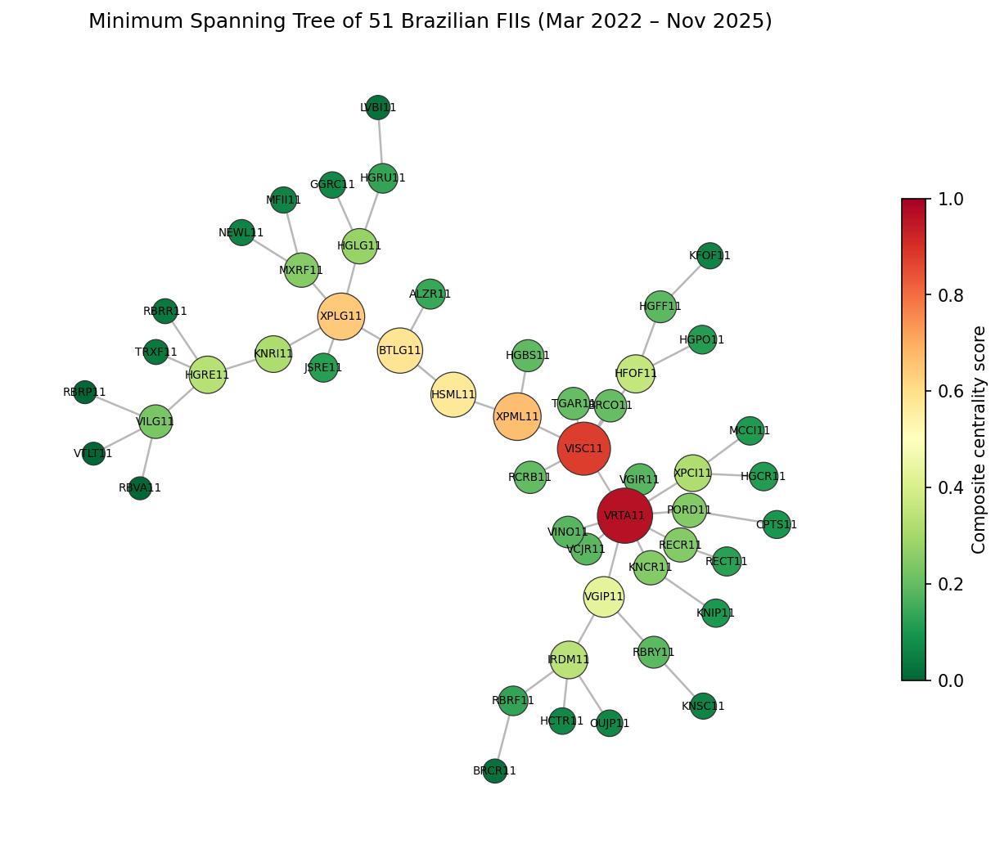
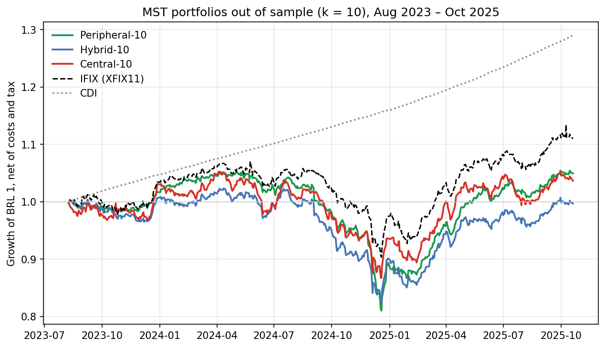

# IC-AGM-FIIs

[](https://github.com/Augusto-Carneiro/IC-AGM-FIIs/actions/workflows/reproduce.yml)
[](LICENSE)
[](requirements.txt)
[](https://colab.research.google.com/github/Augusto-Carneiro/IC-AGM-FIIs/blob/main/ic_agm_augusto.ipynb)

**Minimum Spanning Tree (MST) portfolio selection for Brazilian real estate
investment funds (FIIs).**

This repository is my implementation of the MST arm of an undergraduate
research project (PIBIC/CNPq, University of Campinas) that compares
correlation-network filters as tools for portfolio selection. It
independently reproduces the MST results reported in the manuscript

> A. Carneiro da Silva, Y. S. Jang and J. R. Bertini Junior.
> *A Unified Comparison of Graph-Based Portfolio Construction for Brazilian
> Real Estate Investment Funds under Realistic Trading Conditions.*
> Manuscript in preparation.



## What it does

1. Takes daily total returns of 51 liquid FIIs listed on B3 (March 2022 to
   November 2025, 920 sessions).
2. Converts the Pearson correlation matrix into the Mantegna distance
   `d = sqrt(2 (1 - rho))` and extracts the Minimum Spanning Tree with
   Kruskal's algorithm.
3. Ranks funds by a composite centrality score (min–max normalised mean of
   degree, betweenness and closeness).
4. Forms Central, Peripheral and Hybrid equal-weight portfolios of 10, 15 and
   20 funds, testing the "invest in the periphery" hypothesis of Pozzi, Di
   Matteo and Aste (2013).
5. Evaluates them out of sample with a 360/22-session walk-forward (550
   sessions, 25 rebalances), net of a 0.30% cost on turnover and of the 20%
   Brazilian tax on realised price gains (FII distributions are tax-exempt).
6. Reports Sharpe ratios in excess of the daily CDI rate, and tests the
   Peripheral–Central difference with a circular block bootstrap and the
   Jobson–Korkie test.

The last cell checks the results against the manuscript and ends with
`Tudo confere com o artigo.` when every value matches.

## Results (MST, net of costs and tax)

| Portfolio | k | Sharpe | Turnover |
|---|---|---|---|
| Central | 10 / 15 / 20 | −1.15 / −1.49 / −1.41 | 0.28 / 0.27 / 0.25 |
| Peripheral | 10 / 15 / 20 | −1.25 / −1.22 / −1.12 | 0.44 / 0.35 / 0.30 |
| Hybrid | 10 / 15 / 20 | −1.49 / −1.41 / −1.30 | 0.44 / 0.40 / 0.35 |
| IFIX (XFIX11) | — | −0.91 | — |



Every Sharpe ratio is negative because no FII portfolio, nor the index,
outperformed the CDI (about 12% per annum) over the window — the dotted line
above. The Peripheral–Central difference at k = 10 is −0.10 (95% CI
[−1.13, +1.07], p = 0.87): not statistically significant.

## How to run

**Colab:** click the badge above, then *Runtime → Run all*.

**Locally** (Python 3.12):

```bash
pip install -r requirements.txt
python ic_agm_augusto.py
```

The input data are downloaded automatically from the project's repository,
pinned to a fixed commit and verified by SHA-256 checksum: if a file ever
changes upstream, the run stops instead of silently producing different
numbers. To use a copy you already have, point `IC_DADOS` at its `data/raw`
folder.

## Continuous verification

A [GitHub Actions workflow](.github/workflows/reproduce.yml) runs the
notebook and checks every value against the manuscript on each push and
once a month, twice: with the pinned versions in `requirements.txt` and with
the latest release of every library (the ones Colab uses). The badge at the
top shows the result of the last run.

## Data and credits

The frozen raw series (adjusted and unadjusted prices, distributions, the
XFIX11 benchmark and the CDI) come from
[yoonsungj04/IC_Grafos_FIIs](https://github.com/yoonsungj04/IC_Grafos_FIIs),
the shared pipeline of the project, which also contains the Planar Maximally
Filtered Graph (PMFG) arm developed by **Yoon Sung Jang** and is the code
cited by the manuscript. The project was supervised by
**Prof. Dr. João Roberto Bertini Junior** (School of Technology, UNICAMP) and
funded by PIBIC/CNPq and UNICAMP.

The notebook begins with a table of the corrections made to the version used
in my original PIBIC report.

## Citation

Use the *Cite this repository* button on the right, which reads
[`CITATION.cff`](CITATION.cff).

## Em português

Implementação do braço da Árvore Geradora Mínima (AGM) da Iniciação
Científica sobre formação de carteiras de FIIs por grafos. O notebook
reproduz exatamente os resultados da AGM do artigo, com custos de transação
sobre o giro e IR de 20% sobre o ganho de preço realizado. Para rodar, abra
no Colab pelo botão acima e use *Ambiente de execução → Executar tudo*. A
cada alteração, o GitHub roda o notebook sozinho e confere os resultados
com o artigo.

## License

[MIT](LICENSE)
